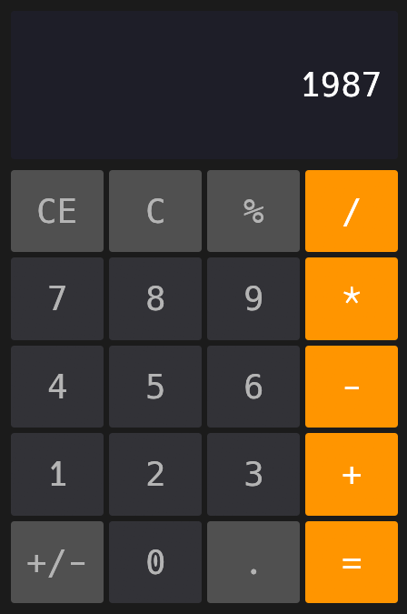

# Hesap

Hesap is a simple Rust calculator app made using [`egui`](https://github.com/emilk/egui).

## Usage

To use Hesap just simply run `cargo run --release`.

Hesap supports both mouse and keyboard input with special mappings for:

| Key        | Button |
|------------|--------|
| c          | C      |
| C          | CE     |  
| = OR Enter | =      |  
| s          | +/-    |  
| . OR ,     | .      |  

The keyboard input also supports backspace and copy/paste to clipboard

### NOTE
The compilation might take a while if you have never 
used [`egui`](https://github.com/emilk/egui) and its dependencies.